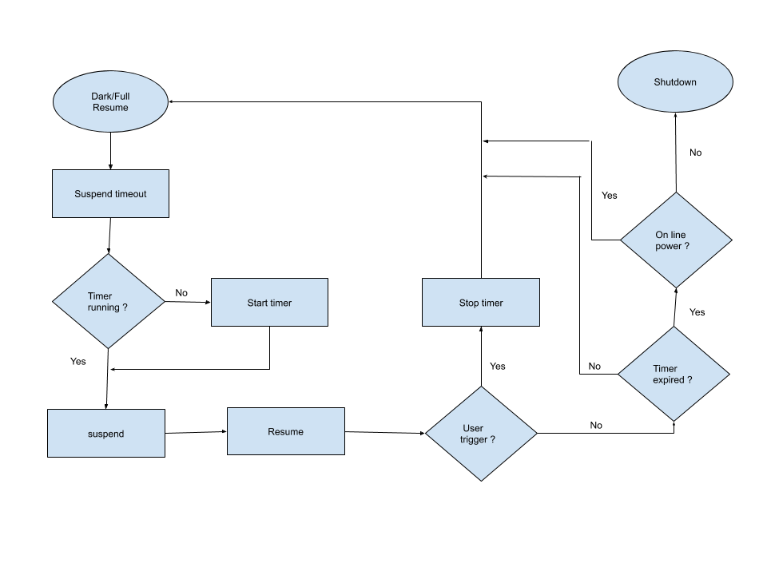

# Shutdown From Suspend

[TOC]

## Introduction

This feature extends the battery life of Chrome OS device during prolonged
non-use by proactively shutting down the device after a configurable time.

## Details

Chrome OS devices usually support at least 14 days of standby. Users that return
to the device tend to do so in the first 3 days. Thus instead of sitting in
standby until the battery is completely discharged, this feature shuts down the
device proactively after spending configured time in standby. This helps in
reducing battery degradation due to deep discharge. This can also reduce the
frequency of trickle charges during boot.

This flowchart depicts the state machine for shutdown-from-suspend.


powerd before every suspend will schedule an alarm (that can
wake the system from standby) if one is not already running for
`shutdown_from_suspend_sec` pref. On every resume, powerd identifies
if the wake is triggered by the user. If so, powerd stops the alarm and resets
the state machine. If not, powerd checks if the timer set above has expired.
If the timer has expired, powerd will shut down the device if line power is not
connected.

## Enabling shutdown-from-suspend on a new device

*   Make sure [Dark Resume] is enabled on the device.
*   Configure `shutdown_from_suspend_sec` pref for the device.

## Debugging shutdown-from-suspend

### Configuring shutdown-from-suspend on a test image

*  [Enable Dark Resume] on the test image.
*   Perform the following steps to enable shutdown-from-suspend:

```sh
# echo x > /var/lib/power_manager/shutdown_from_suspend_sec
# restart powerd
```

### Disabling shutdown-from-suspend on a test image

Perform the following steps to disable shutdown-from-suspend:

```sh
# echo 0 > /var/lib/power_manager/shutdown_from_suspend_sec
# restart powerd
```

[Dark Resume]: ./dark_resume.md
[Enable Dark Resume]: ./dark_resume.md#enabling-dark-resume
